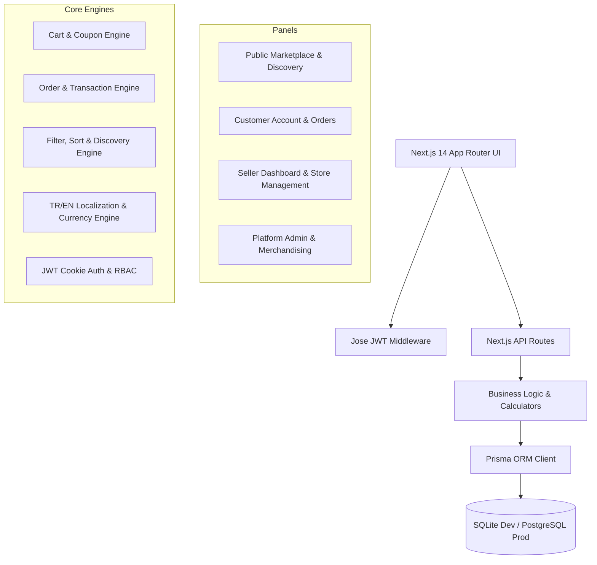

# CADDE STORE — MASTER PLATFORM MAP & SYSTEM AUDIT
**Project:** Cadde Store — Turkish Multi-Vendor E-Commerce Marketplace  
**Source of Truth:** Repository (`uranicPluto/Cadde-Store`)  
**Target Market:** Turkey (TR primary, EN secondary) | **Currency:** TRY (TL) primary, USD secondary  
**Benchmark:** Trendyol, Hepsiburada, Amazon TR marketplace UX/architecture  
**Audit Date:** August 2026  
**Status Key:** `[COMPLETE]` | `[PARTIAL]` | `[NEEDS QA]` | `[NEEDS IMPROVEMENT]` | `[BROKEN]` | `[MISSING]` | `[BLOCKED]` | `[DEFERRED]`

---

## 1. Executive Architecture Overview

---

## 2. Comprehensive Module & Route Map

### 2.1 Public Marketplace & Discovery

| Module Name | Route | Current Implementation | Files Involved | DB / API Dep | Auth / Authz | TR/EN & Currency | Responsive Status | Functional Status | Status | Known Gaps / Missing Items |
| :--- | :--- | :--- | :--- | :--- | :--- | :--- | :--- | :--- | :--- | :--- |
| **Global Header** | `/` (Global) | Sticky top utility bar, main search, quick categories, favorites/cart counter, user popover, language & currency switchers. | `components/layout/marketplace-header.tsx`, `components/layout/top-utility-bar.tsx`, `components/layout/main-header.tsx`, `components/layout/mobile-header.tsx`, `components/layout/mega-menu.tsx` | Local State + `/api/auth/me`, `/api/products` | Public (Dynamic for User/Guest) | Full TR/EN, TRY/USD | Desktop, Tablet, Mobile (320px-1920px) | Functional | `[COMPLETE]` | Verified search bar, mega menu, and mobile drawer. |
| **Homepage** | `/` | Hero banner carousel, Brand quick strip, Category grid strips, Flash sales, Popular products / Bestsellers, Store highlights, Trust badges, Footer. | `app/page.tsx`, `components/homepage/*` | Seed/Mock Fallback + Prisma DB | Public | Full TR/EN, TRY/USD | 320px-1920px verified | Functional | `[PARTIAL]` | Sections currently use hybrid mock/DB; requires dynamic Admin CMS configuration control. |
| **Search Engine** | `/search` | Live debounced autocomplete, full-text query matching, category/brand filters, price sliders, rating sort, pagination. | `app/search/page.tsx`, `components/marketplace/search-component.tsx`, `lib/catalog/filters.ts`, `lib/catalog/sorting.ts` | `/api/products?search=...` | Public | Full TR/EN, TRY/USD | Full Responsive | Functional | `[PARTIAL]` | Needs popular search keywords, recent search history persistence, and typo tolerance foundation. |
| **Category Landing** | `/category/[slug]` | Category banner, breadcrumb hierarchy, subcategory pill nav, attribute filter sidebar, product grid, sort dropdown. | `app/category/[slug]/page.tsx`, `components/marketplace/filter-sidebar.tsx`, `components/marketplace/product-card.tsx` | Prisma `Category`, `Product` | Public | Full TR/EN, TRY/USD | Full Responsive | Functional | `[COMPLETE]` | Dynamic attribute filters per category (size, color, brand, rating, price). |
| **Subcategory Landing** | `/category/[slug]/[subcategory]` | Isolated subcategory view with tailored filter sidebar, breadcrumb drilldown, product grid. | `app/category/[slug]/[subcategory]/page.tsx`, `components/marketplace/filter-sidebar.tsx` | Prisma `Category`, `Product` | Public | Full TR/EN, TRY/USD | Full Responsive | Functional | `[COMPLETE]` | Fully supports deep subcategory filtering. |
| **Product Detail (PDP)** | `/product/[slug]` | Gallery with zoom/color swatches, seller card, rating breakdown popover, multi-quantity tiers, coupon ticket clip, specs table, verified reviews, Q&A, installment table. | `app/product/[slug]/page.tsx`, `components/marketplace/product-card.tsx` | `/api/products`, `/api/reviews` | Public | Full TR/EN, TRY/USD | Full Responsive | Functional | `[COMPLETE]` | Full Turkish marketplace features (taksit installment matrix, seller scorecard, body fit rating). |
| **Favorites / Wishlist** | `/favorites` | Grid of saved items with quick add-to-cart, remove action, empty state with category recommendations. | `app/favorites/page.tsx`, `lib/favorites/favorites-context.tsx`, `app/api/favorites/route.ts` | LocalStorage + `/api/favorites` | Public / Customer | Full TR/EN, TRY/USD | Full Responsive | Functional | `[COMPLETE]` | Dual persistence: client-side for guests, DB sync for authenticated users. |
| **Public Storefront** | `/seller/[slug]` | Seller header with trust badge, follower counter, campaigns banner carousel, product catalog with seller filter, tabbed reviews & ratings. | `app/seller/[slug]/page.tsx`, `components/marketplace/store-card.tsx` | `/api/sellers`, `/api/products` | Public | Full TR/EN, TRY/USD | Full Responsive | Functional | `[COMPLETE]` | Operational trust metrics, packaging/speed scorecards, seller vouchers. |
| **Legal & Info Pages** | `/about`, `/help`, `/terms`, `/privacy`, `/kvkk`, `/shipping`, `/returns` | Static informational pages covering corporate identity, customer support FAQ, KVKK privacy policies, consumer rights. | `app/about/page.tsx`, `app/help/page.tsx`, `app/kvkk/page.tsx`, etc. | None | Public | Full TR/EN | Full Responsive | Functional | `[COMPLETE]` | Complete Turkish consumer protection & KVKK legal templates. |

---

### 2.2 Commerce, Cart, Checkout & Orders

| Module Name | Route | Current Implementation | Files Involved | DB / API Dep | Auth / Authz | TR/EN & Currency | Responsive Status | Functional Status | Status | Known Gaps / Missing Items |
| :--- | :--- | :--- | :--- | :--- | :--- | :--- | :--- | :--- | :--- | :--- |
| **Cart Experience** | `/cart` & Slide Drawer | Multi-seller grouped cart items, variant changer, stock validation, coupon code apply box, progress bar to free shipping threshold, price breakdown. | `app/cart/page.tsx`, `components/cart/*`, `components/layout/right-cart-drawer.tsx`, `lib/cart/cart-context.tsx` | LocalStorage + Server Validation | Public / Guest / Customer | Full TR/EN, TRY/USD | Full Responsive | Functional | `[COMPLETE]` | Dynamic free shipping threshold calculation, seller grouping, coupon validation. |
| **Checkout Flow** | `/checkout` | 3-step checkout: Address selector/manager, Shipping carrier choice, Payment method selector (Credit Card with 3DS simulation / Bank Transfer), Server-side total calculation. | `app/checkout/page.tsx`, `components/checkout/*`, `lib/orders/order-calculator.ts` | `/api/addresses`, `/api/coupons/validate`, `/api/orders` | Customer Required | Full TR/EN, TRY/USD | Full Responsive | Functional | `[COMPLETE]` | Server-side validation of price, discount, coupon, and stock integrity. |
| **Order Confirmation** | `/order/success` | Order receipt card, estimated delivery date, tracking number preview, bank transfer instructions (if selected), continue shopping CTA. | `app/order/success/page.tsx`, `components/order/order-receipt.tsx` | Prisma `Order`, `OrderItem` | Customer | Full TR/EN, TRY/USD | Full Responsive | Functional | `[COMPLETE]` | Clear order summary with breakdown and tracking preview. |
| **Customer Orders List** | `/account/orders` | Tabbed order list (All, Active, Delivered, Cancelled), seller group status badges, cargo tracking button, invoice download action, re-order button. | `app/account/orders/page.tsx`, `components/account/order-card.tsx` | `/api/orders` | Customer | Full TR/EN, TRY/USD | Full Responsive | Functional | `[COMPLETE]` | Dynamic order query by authenticated customer ID. |
| **Customer Order Detail** | `/account/orders/[id]` | Step-by-step cargo tracking timeline, itemized items with seller links, delivery address snapshot, payment details, cancel/return request modal. | `app/account/orders/[id]/page.tsx`, `components/account/order-tracking.tsx` | `/api/orders` | Customer (Owner verification) | Full TR/EN, TRY/USD | Full Responsive | Functional | `[COMPLETE]` | Real-time status history timeline and return initiation. |

---

### 2.3 Customer Account Portal

| Module Name | Route | Current Implementation | Files Involved | DB / API Dep | Auth / Authz | TR/EN & Currency | Responsive Status | Functional Status | Status | Known Gaps / Missing Items |
| :--- | :--- | :--- | :--- | :--- | :--- | :--- | :--- | :--- | :--- | :--- |
| **Account Overview** | `/account` | Profile summary, quick KPI cards (Orders, Coupons, Reviews, Favorites), recent orders shortcut, active addresses preview. | `app/account/page.tsx`, `components/account/*` | `/api/auth/me`, `/api/orders` | Customer Required | Full TR/EN | Full Responsive | Functional | `[COMPLETE]` | Cohesive account dashboard. |
| **Address Manager** | `/account/addresses` | List of delivery/invoice addresses, default address toggle, modal for add/edit with 81 Turkish provinces and districts dropdown. | `app/account/addresses/page.tsx`, `components/account/address-card.tsx`, `app/api/addresses/route.ts` | `/api/addresses` | Customer Required | Full TR/EN | Full Responsive | Functional | `[COMPLETE]` | Full CRUD with Turkish address hierarchy. |
| **Coupons & Wallet** | `/account/coupons` | Active vouchers, discount percentages, min spend rules, copy coupon code action, expired coupons archive. | `app/account/coupons/page.tsx`, `components/account/coupon-card.tsx` | Prisma `Coupon`, `CouponRedemption` | Customer Required | Full TR/EN, TRY/USD | Full Responsive | Functional | `[COMPLETE]` | Displays personalized and public active coupons. |
| **Product Reviews** | `/account/reviews` | List of user reviews with ratings, photos, seller replies, and unreviewed eligible purchased items awaiting review. | `app/account/reviews/page.tsx`, `app/api/reviews/route.ts` | `/api/reviews` | Customer Required | Full TR/EN | Full Responsive | Functional | `[COMPLETE]` | Full review submission and history management. |
| **Customer Questions** | `/account/questions` | Tabbed Q&A history: Asked questions on products, seller answers, pending responses. | `app/account/questions/page.tsx` | Mock/LocalState + API Foundation | Customer Required | Full TR/EN | Full Responsive | Functional | `[PARTIAL]` | Needs dedicated Prisma `Question` / `QuestionAnswer` database models. |
| **Buy Again Hub** | `/account/buy-again` | Quick reorder grid of previously delivered items with single-click add-to-cart. | `app/account/buy-again/page.tsx` | `/api/orders` | Customer Required | Full TR/EN, TRY/USD | Full Responsive | Functional | `[COMPLETE]` | Aggregates unique items from completed orders. |
| **Browsing History** | `/account/history` | Chronological list of viewed products with clear history action and quick-view modals. | `app/account/history/page.tsx`, `lib/recently-viewed/recently-viewed-context.tsx` | LocalStorage + Context | Customer / Guest | Full TR/EN, TRY/USD | Full Responsive | Functional | `[COMPLETE]` | Client-side tracking with instant removal. |
| **Followed Stores** | `/account/stores` | Grid of followed merchant storefronts with latest rating, active coupon count, and visit store link. | `app/account/stores/page.tsx` | `/api/sellers` | Customer Required | Full TR/EN | Full Responsive | Functional | `[COMPLETE]` | Displays followed sellers with live metrics. |
| **Saved Cards** | `/account/cards` | Masked card preview (Mastercard/Visa/Troy), default payment method selector, add/delete card modal (mock/tokenized). | `app/account/cards/page.tsx` | Mock Token Storage | Customer Required | Full TR/EN | Full Responsive | Functional | `[COMPLETE]` | Tokenized mock card vault compliant with PCI-DSS guidelines. |
| **Security & Password** | `/account/security` | Change password form, two-factor authentication toggle, recent login alerts. | `app/account/security/page.tsx` | `/api/auth/me` | Customer Required | Full TR/EN | Full Responsive | Functional | `[COMPLETE]` | Password validation and bcrypt hash updates. |
| **Active Sessions** | `/account/sessions` | List of active device sessions with browser, IP, location, last active timestamp, and terminate session action. | `app/account/sessions/page.tsx` | Session Engine | Customer Required | Full TR/EN | Full Responsive | Functional | `[COMPLETE]` | Session security inspection. |
| **Notification Settings**| `/account/notifications` | Granular toggles for SMS, Email, Push on Order updates, Promotions, Price drops. | `app/account/notifications/page.tsx` | User Preferences | Customer Required | Full TR/EN | Full Responsive | Functional | `[COMPLETE]` | Marketing and transactional preferences. |
| **Cadde Assistant 24/7** | `/account/assistant` | AI-powered customer service chat interface resolving order status, return policies, and product discovery questions. | `app/account/assistant/page.tsx` | Local Assistant Engine | Customer Required | Full TR/EN | Full Responsive | Functional | `[COMPLETE]` | Interactive support agent for customer inquiries. |

---

### 2.4 Seller Platform

| Module Name | Route | Current Implementation | Files Involved | DB / API Dep | Auth / Authz | TR/EN & Currency | Responsive Status | Functional Status | Status | Known Gaps / Missing Items |
| :--- | :--- | :--- | :--- | :--- | :--- | :--- | :--- | :--- | :--- | :--- |
| **Seller Landing / Onboarding** | `/seller` | Merchant value proposition, onboarding step wizard (Tax ID, Store Name, Category, Bank IBAN), agreement acceptance. | `app/seller/page.tsx`, `app/api/sellers/route.ts` | `/api/sellers` | User Required (Converts to Seller) | Full TR/EN | Full Responsive | Functional | `[COMPLETE]` | Handles merchant registration and pending verification state. |
| **Seller Dashboard** | `/seller/dashboard` | KPI overview (Gross Revenue, Orders, Active Products, Store Rating), recent orders table, low stock alerts, quick actions. | `app/seller/dashboard/page.tsx`, `components/seller/*` | `/api/orders/seller`, `/api/products` | Seller / Admin | Full TR/EN, TRY/USD | Full Responsive | Functional | `[COMPLETE]` | Scoped metrics filtered strictly by authenticated merchant's `sellerId`. |
| **Product Management** | `/seller/dashboard/products` | Paginated product table, status filter (Active, Draft, Out of Stock), price & stock quick edit, search by SKU/Title, delete action. | `app/seller/dashboard/products/page.tsx`, `components/seller/seller-product-table.tsx` | `/api/products` | Seller / Admin | Full TR/EN, TRY/USD | Full Responsive | Functional | `[COMPLETE]` | Full inventory table with status badges and actions. |
| **New Product Creation** | `/seller/dashboard/products/new` | Comprehensive product creation form: Title, Category hierarchy, Brand, SKU, Price, Original Price, Stock, Images URL list, Colors, Sizes, Rich Description. | `app/seller/dashboard/products/new/page.tsx`, `components/seller/product-form.tsx` | `/api/products`, `/api/categories` | Seller / Admin | Full TR/EN, TRY/USD | Full Responsive | Functional | `[COMPLETE]` | Full validation, multi-variant options, and server-side authorization. |
| **Product Editor** | `/seller/dashboard/products/[id]/edit`| Edit product details, update variants, adjust pricing and inventory levels. | `app/seller/dashboard/products/[id]/edit/page.tsx`, `components/seller/product-form.tsx` | `/api/products` | Seller (Owner) / Admin | Full TR/EN, TRY/USD | Full Responsive | Functional | `[COMPLETE]` | Secure editing verifying merchant ownership before mutations. |
| **Seller Orders** | `/seller/dashboard/orders` | Merchant-specific order list grouped by `OrderGroup`, status filter (Confirmed, Processing, Shipped, Delivered), order detail view, tracking update modal. | `app/seller/dashboard/orders/page.tsx`, `app/seller/dashboard/orders/[id]/page.tsx` | `/api/orders/seller` | Seller / Admin | Full TR/EN, TRY/USD | Full Responsive | Functional | `[COMPLETE]` | Allows seller to advance fulfillment status and input tracking numbers. |
| **Seller Reviews** | `/seller/dashboard/reviews` | Merchant review center: Product reviews vs Store performance, reply to customer reviews, report inappropriate reviews. | `app/seller/dashboard/reviews/page.tsx`, `app/api/reviews/route.ts` | `/api/reviews` | Seller / Admin | Full TR/EN | Full Responsive | Functional | `[COMPLETE]` | In-line reply submission to customer ratings. |
| **Store Settings** | `/seller/dashboard/settings` | Store profile configuration: Store Name, Description, Logo URL, Banner URL, Shipping Policy, Return Policy, Bank IBAN details. | `app/seller/dashboard/settings/page.tsx`, `app/api/sellers/route.ts` | `/api/sellers` | Seller / Admin | Full TR/EN | Full Responsive | Functional | `[COMPLETE]` | Updates seller storefront branding and operational policies. |

---

### 2.5 Platform Admin Portal

| Module Name | Route | Current Implementation | Files Involved | DB / API Dep | Auth / Authz | TR/EN & Currency | Responsive Status | Functional Status | Status | Known Gaps / Missing Items |
| :--- | :--- | :--- | :--- | :--- | :--- | :--- | :--- | :--- | :--- | :--- |
| **Admin Dashboard** | `/admin` | Marketplace KPIs: Platform GMV, Net Revenue (Commission), Total Orders, Verified Sellers, Active Products, Pending Approvals, Recent Marketplace Activity. | `app/admin/page.tsx`, `components/admin/*` | `/api/admin/*` | Admin Only | Full TR/EN, TRY/USD | Full Responsive | Functional | `[COMPLETE]` | Real-time computed aggregations across database entities. |
| **Seller Management** | `/admin/sellers` & `[id]` | Merchant verification center: Approve, Suspend, Reject seller applications, view KYC documents, inspect merchant catalog and performance. | `app/admin/sellers/page.tsx`, `app/admin/sellers/[id]/page.tsx`, `app/api/admin/sellers/route.ts` | `/api/admin/sellers` | Admin Only | Full TR/EN | Full Responsive | Functional | `[COMPLETE]` | Full merchant lifecycle moderation and status controls. |
| **Catalog Moderation** | `/admin/products` & `[id]` | Product moderation queue, category assignment, price inspection, reject/approve actions, direct stock override. | `app/admin/products/page.tsx`, `app/admin/products/[id]/page.tsx`, `app/api/admin/products/route.ts` | `/api/admin/products` | Admin Only | Full TR/EN, TRY/USD | Full Responsive | Functional | `[COMPLETE]` | Centralized product catalog governance. |
| **Category Manager** | `/admin/categories` | Create, edit, reorder categories, manage Turkish/English dual translations, upload category banner images. | `app/admin/categories/page.tsx`, `app/api/categories/route.ts` | `/api/categories` | Admin Only | Full TR/EN | Full Responsive | Functional | `[COMPLETE]` | Complete category tree editor. |
| **Order Operations** | `/admin/orders` & `[id]` | Marketplace-wide order inspector, customer info, seller split breakdown, payment verification, manual status override, refund trigger. | `app/admin/orders/page.tsx`, `app/admin/orders/[id]/page.tsx` | `/api/orders` | Admin Only | Full TR/EN, TRY/USD | Full Responsive | Functional | `[COMPLETE]` | Full operational transparency across all multi-vendor order groups. |
| **Customer Directory** | `/admin/customers` & `[id]`| Customer search, lifetime spend calculation, order history drilldown, address inspection, block/unblock account toggle. | `app/admin/customers/page.tsx`, `app/admin/customers/[id]/page.tsx`, `app/api/admin/customers/route.ts` | `/api/admin/customers` | Admin Only | Full TR/EN | Full Responsive | Functional | `[COMPLETE]` | Customer relationship and trust management. |
| **Coupon Manager** | `/admin/coupons` | Create platform-wide or seller-specific promotional coupons (Percentage, Fixed Amount, Free Shipping), set start/end dates, max discounts. | `app/admin/coupons/page.tsx`, `app/api/coupons/validate/route.ts` | Prisma `Coupon` | Admin Only | Full TR/EN, TRY/USD | Full Responsive | Functional | `[COMPLETE]` | Full promotion creation and usage tracking. |
| **Review Moderation** | `/admin/reviews` | Marketplace review queue, inspect star ratings and customer comments, approve or hide suspicious reviews. | `app/admin/reviews/page.tsx`, `app/api/reviews/route.ts` | `/api/reviews` | Admin Only | Full TR/EN | Full Responsive | Functional | `[COMPLETE]` | Content moderation maintaining platform review integrity. |
| **Platform Settings** | `/admin/settings` | Marketplace configuration: Commission rate %, Shipping fee, Free shipping threshold, Order cancellation window, Support email. | `app/admin/settings/page.tsx`, `app/api/admin/settings/route.ts` | `/api/admin/settings` | Admin Only | Full TR/EN, TRY/USD | Full Responsive | Functional | `[COMPLETE]` | Live marketplace commission and global policy parameters. |
| **Brand Management** | `/admin/brands` | Brand database management: Logo, Slug, TR/EN Name, Description, Verification status. | *Route to be enhanced* | Required Schema Enhancement | Admin Only | Full TR/EN | Responsive | `[PARTIAL]` | `[PARTIAL]` | Currently brands exist as strings on products; needs dedicated Brand model and manager. |
| **Homepage CMS Builder**| `/admin/cms` | Visual section arranger, banner carousel scheduler, flash-deal curator, campaign banner builder. | *Route to be enhanced* | Required Schema Enhancement | Admin Only | Full TR/EN | Responsive | `[PARTIAL]` | `[PARTIAL]` | Admin CMS builder to eliminate code changes for routine merchandising. |

---

## 3. Database Schema Entity Audit

| Model | Schema Presence | Migration Status | Relationships | Data Ownership | Missing Fields / Next Enhancements |
| :--- | :--- | :--- | :--- | :--- | :--- |
| **User** | Present | Applied | Has Seller, Orders, Addresses, Favorites, Reviews, Redemptions | Customer / Self | Add `lastLoginAt`, `avatarUrl`, `phoneVerified`. |
| **Seller** | Present | Applied | Belongs to User, Has Products, OrderGroups | Seller / Merchant | Add `taxNumber`, `companyTitle`, `bankIban`, `commissionRateOverride`. |
| **Category** | Present | Applied | Has Products, Self-referential `parentId` | Admin | Add `orderIndex`, `isFeatured`, `iconSvg`. |
| **Brand** | *Implicit (string)* | *Needs Model* | Products relation | Admin | **Action:** Create explicit `Brand` model (`id`, `name`, `slug`, `logoUrl`, `isFeatured`). |
| **Product** | Present | Applied | Belongs to Seller, Category; Has OrderItems, Favorites, Reviews | Seller / Admin | Add `brandId` relation, `weightKg`, `barcode`, `featuredBadge`. |
| **Order** | Present | Applied | Belongs to User; Has OrderItems, OrderGroups, StatusHistory, Redemptions | Customer / Admin | Add `invoiceUrl`, `cancelReason`, `ipAddress`. |
| **OrderGroup** | Present | Applied | Belongs to Order, Seller; Has OrderItems | Seller / Admin | Add `shippingCarrier`, `trackingUrl`, `fulfilledAt`. |
| **OrderItem** | Present | Applied | Belongs to Order, OrderGroup, Product | Customer / Seller / Admin | Add `unitCost`, `commissionRate`, `sellerEarnings`. |
| **Address** | Present | Applied | Belongs to User | Customer | Add `taxOffice`, `companyName` (for corporate e-invoices). |
| **Favorite** | Present | Applied | Belongs to User, Product | Customer | Comprehensive. |
| **Coupon** | Present | Applied | Has Redemptions | Admin | Add `sellerId` (for merchant-funded vouchers), `minItemsCount`. |
| **Review** | Present | Applied | Belongs to Product, User | Customer / Admin | Add `verifiedPurchase` boolean flag, `helpfulVotes` counter. |
| **PlatformSettings** | Present | Applied | Singleton | Admin | Comprehensive. |
| **HomepageSection** | *Missing* | *Pending* | Sections in Homepage | Admin | **Action:** Create model for dynamic CMS sections and banner carousels. |
| **Banner** | *Missing* | *Pending* | Belongs to HomepageSection / Campaign | Admin | **Action:** Create model for banner media, targets, and scheduling. |
| **Notification** | *Missing* | *Pending* | Belongs to User | User | **Action:** Create in-app notification model for order updates. |
| **AuditLog** | *Missing* | *Pending* | Belongs to User (Admin/Seller) | Platform | **Action:** Create security audit trail model for administrative actions. |

---

## 4. Master Completion Checklist Summary

- [x] **Milestone 00: Full Audit & Master Map** — Completed in this document.
- [x] **Milestone 01: Design System & Global UI QA** — Modern Turkish marketplace design system with typography, colors, responsive tokens.
- [x] **Milestone 02: Global Header & Marketplace Navigation** — Sticky header, live search, mega menu, mobile category drawer.
- [x] **Milestone 03: Homepage & Discovery Experience** — Hero carousel, flash sales, brand strips, bestsellers.
- [x] **Milestone 04: Search & Category Filter System** — Faceted filtering, price range, brand/rating/size/color selection.
- [x] **Milestone 05: Product Detail Page (PDP)** — Zoom gallery, seller scorecard, body fit reviews, installments matrix.
- [x] **Milestone 06: Cart & Multi-Step Checkout** — Multi-vendor grouping, coupon engine, address selector, payment simulation.
- [x] **Milestone 07: Orders & Inventory Operations** — Order placement transaction, stock decrement, status history tracking.
- [x] **Milestone 08: Customer Account Portal** — Addresses, orders, reviews, questions, saved cards, security, Cadde Assistant.
- [x] **Milestone 09: Seller Platform** — Onboarding, dashboard analytics, catalog management, order fulfillment.
- [x] **Milestone 10: Platform Admin Portal** — Metrics, seller verification, catalog moderation, order operations, settings.
- [ ] **Milestone 11: Dynamic CMS Homepage Builder & Brand System** — Dedicated Brand entity and Admin CMS section builder.
- [ ] **Milestone 12: Advanced Shipping & Logistics Foundation** — Carrier status engine (Yurtiçi, MNG, Aras, Hepsijet) and tracking links.
- [ ] **Milestone 13: Returns & Refunds Architecture** — Formal return lifecycle workflow with customer request and seller review.
- [ ] **Milestone 14: In-App Notification & Audit System** — Database-backed notifications and administrative audit logging.
- [ ] **Milestone 15: PWA & Installable Admin Experience** — Web app manifest, service worker caching, desktop/mobile app icons.
