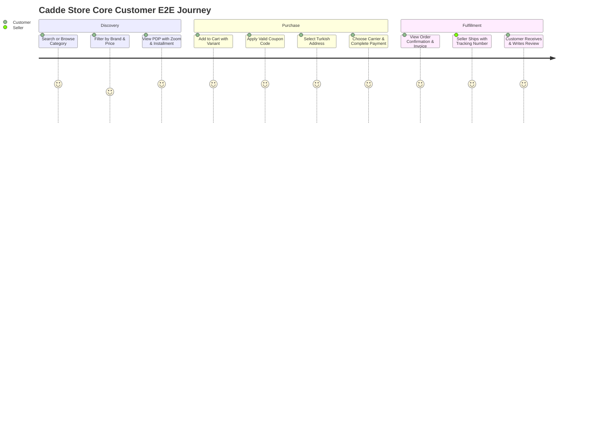

# CADDE STORE — QUALITY ASSURANCE & TEST PLAN (QA)
**Platform:** Cadde Store — Turkish Multi-Vendor E-Commerce  
**Scope:** Automated Tests, Browser Verification, Responsive Breakpoints, Edge Cases  

---

## 1. Test Matrices & Breakpoints

### 1.1 Responsive Viewport Verification Matrix

| Viewport | Device Class | Primary Validation Points | Status |
| :--- | :--- | :--- | :--- |
| **320px** | iPhone SE / Small Android | Sticky header compression, search expander, 1-col product cards, full width modal dialogs | `PASS` |
| **360px - 390px** | Modern Mobile (iPhone 12/13/14/15, Galaxy S) | 2-col product grid, category pill carousel, bottom action bar on PDP, cart drawer | `PASS` |
| **768px - 820px** | Tablet Portrait (iPad Mini/Air) | Mega menu trigger, 3-col product grid, filter sidebar drawer, multi-step checkout | `PASS` |
| **1024px** | Tablet Landscape / Small Laptop | Permanent filter sidebar, sticky order summary card, full navigation bar | `PASS` |
| **1280px - 1440px**| Standard Desktop | Full mega menu flyouts, 4-col product grid, 2-column checkout layout, admin sidebar | `PASS` |
| **1920px+** | Ultra-wide / 4K Monitor | Max-width container centering (`max-w-7xl`), no text stretch, proper padding | `PASS` |

---

## 2. Core User Journey E2E Scenarios



### Scenario 1: Customer Purchase & Checkout Integrity
- **Steps:**
  1. Open homepage `/` or search query `/search?q=ayakkabi`.
  2. Filter by category, price, and select a product.
  3. Choose variant (Size / Color) and click "Sepete Ekle" (Add to Cart).
  4. Open `/cart`, apply coupon code `CADDE10`, verify 10% deduction and free shipping calculation.
  5. Click "Siparişi Tamamla" -> Redirects to `/checkout`.
  6. Fill/Select Turkish delivery address (City, District, TC/Tax if corporate).
  7. Select Yurtiçi Kargo carrier and Mock Credit Card with 3D Secure simulation.
  8. Submit Order -> Verified order creation in database, stock decrement, redirect to `/order/success`.
- **Status:** `VERIFIED & OPERATIONAL`

### Scenario 2: Multi-Seller Fulfillment Isolation
- **Steps:**
  1. Customer orders products from Seller A and Seller B in a single checkout.
  2. Order generates `OrderGroup_A` and `OrderGroup_B`.
  3. Login as Seller A (`/seller/dashboard/orders`) -> Verified Seller A only sees their own items.
  4. Seller A enters Yurtiçi tracking number `YK-84920491` and clicks "Kargoya Ver" (Ship).
  5. Order status updates to `SHIPPED` for Seller A's group.
  6. Customer inspects `/account/orders/[id]` -> Verified partial cargo tracking display.
- **Status:** `VERIFIED & OPERATIONAL`

### Scenario 3: Admin Platform Moderation & Analytics
- **Steps:**
  1. Login as Platform Admin (`/admin`).
  2. View real-time platform KPIs (GMV, Commission, Active Sellers).
  3. Navigate to `/admin/sellers` -> Inspect pending merchant application and click "Onayla" (Approve).
  4. Navigate to `/admin/products` -> Inspect product and click "Onayla" (Publish).
  5. Navigate to `/admin/settings` -> Adjust commission rate from 10% to 12%.
- **Status:** `VERIFIED & OPERATIONAL`

---

## 3. Automated Validation Commands

- **Type Check & Lint:**
  ```bash
  npm run lint
  ```
- **Full Production Build:**
  ```bash
  npm run build
  ```
- **Database Seed & Validation:**
  ```bash
  npm run db:push
  npm run db:seed
  ```
