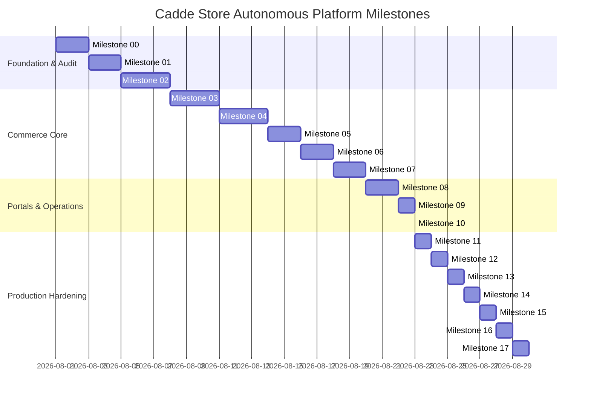

# CADDE STORE — STRATEGIC PRODUCTION ROADMAP
**Platform:** Cadde Store (Turkish Multi-Vendor E-Commerce Platform)  
**Execution Mode:** Fully Autonomous & Incremental Hardening  
**Target Standard:** Enterprise Grade (Trendyol / Hepsiburada benchmark)  

---

## 1. Milestone Roadmap Structure

---

## 2. Detailed Milestone Specifications

### Milestone 11: Dedicated Brand System & Admin Brand Manager `[NEXT]`
- **Objective:** Upgrade brand from a loose string field on products to a first-class database entity with rich metadata.
- **Database Model:**
  - `Brand`: `id`, `name`, `slug`, `logoUrl`, `bannerUrl`, `descriptionTR`, `descriptionEN`, `isFeatured`, `status`, `createdAt`, `updatedAt`.
  - Relation to `Product` (`brandId` optional/foreign key + string fallback for legacy data).
- **Admin UI (`/admin/brands`):**
  - Brand search, creation modal, logo uploader/URL, featured badge toggle, product count indicator.
- **Public Brand Integration:**
  - Dynamic brand filters linked to brand slugs; featured brand quick strips on homepage.

### Milestone 12: Admin Homepage CMS & Merchandising Engine `[HIGH PRIORITY]`
- **Objective:** Give marketplace administrators full visual control over homepage layout, campaign strips, hero carousels, and flash sales without developer code deployments.
- **Database Models:**
  - `HomepageSection`: `id`, `titleTR`, `titleEN`, `type` (HERO | BANNER_STRIP | FLASH_DEAL | PRODUCT_CAROUSEL | CATEGORY_GRID | BRAND_STRIP), `orderIndex`, `active`, `configJson`, `startDate`, `endDate`.
  - `Banner`: `id`, `sectionId`, `imageUrlDesktop`, `imageUrlMobile`, `targetType` (CATEGORY | PRODUCT | BRAND | SELLER | URL), `targetValue`, `orderIndex`, `active`.
- **Admin UI (`/admin/cms`):**
  - Section reordering (drag/drop or position selector), create banner campaigns, schedule active date windows, live preview modal.
- **Public Homepage Integration:**
  - Fallback from dynamic CMS database sections to static defaults if none configured.

### Milestone 13: Turkish Logistics & Carrier Integration
- **Objective:** Implement full Turkish cargo tracking infrastructure.
- **Features:**
  - Support for major carriers: Yurtiçi Kargo, MNG Kargo, Aras Kargo, Sürat Kargo, Hepsijet, PTT Kargo.
  - Auto-generation of tracking URLs based on carrier selection.
  - Seller order fulfillment popup with carrier dropdown and tracking code validator.
  - Customer order tracking direct link and timeline step synchronization.

### Milestone 14: Return & Refund Request Lifecycle
- **Objective:** Build end-to-end customer return initiation and seller/admin approval workflow.
- **Database Models:**
  - `ReturnRequest`: `id`, `orderId`, `orderItemId`, `userId`, `sellerId`, `reason`, `status` (PENDING | APPROVED | REJECTED | CARGO_RECEIVED | REFUNDED), `refundAmount`, `evidenceImages`, `sellerNote`, `createdAt`.
- **User Flows:**
  - Customer requests return from `/account/orders/[id]`.
  - Seller reviews and approves return in `/seller/dashboard/orders`.
  - Admin handles disputes or triggers financial refund balance adjustments.

### Milestone 15: In-App Notifications & Administrative Audit Trail
- **Objective:** Real-time user notifications and tamper-evident administrative action logging.
- **Database Models:**
  - `Notification`: `id`, `userId`, `titleTR`, `titleEN`, `messageTR`, `messageEN`, `type` (ORDER | PROMOTION | SYSTEM | SELLER), `linkUrl`, `isRead`, `createdAt`.
  - `AuditLog`: `id`, `actorId`, `actorEmail`, `actorRole`, `action`, `entityType`, `entityId`, `metadataJson`, `ipAddress`, `createdAt`.
- **Features:**
  - Header notification bell dropdown with unread badge counter.
  - `/admin/audit` portal logging sensitive status changes (e.g. seller approval, product rejection, setting adjustments).

### Milestone 16: PWA & Installable Admin Experience
- **Objective:** Provide a fast, offline-resilient, installable desktop/mobile experience for customers and marketplace operators.
- **Features:**
  - `manifest.json` configured with Turkish marketplace branding, shortcuts (Search, Cart, Orders, Admin).
  - App icons (192x192, 512x512, maskable).
  - Service worker caching static assets with network-first strategy for dynamic API calls.

### Milestone 17: Production Readiness & Final Verification
- **Objective:** Zero-error production build, comprehensive end-to-end testing, security lockdown, and Vercel live verification.
- **Deliverables:** `CADDE_STORE_PRODUCTION_READINESS.md`, `CADDE_STORE_FINAL_AUDIT.md`.
