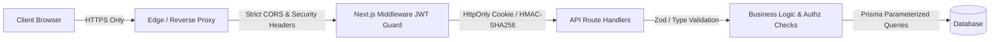

# CADDE STORE — SECURITY & DATA INTEGRITY POLICY
**Platform:** Cadde Store (Turkish Multi-Vendor E-Commerce Marketplace)  
**Standard:** OWASP Top 10, KVKK (Turkish Personal Data Protection Law), PCI-DSS Compliance Guidelines  

---

## 1. Security Architecture & Controls

---

## 2. Key Security Mechanisms

### 2.1 Authentication & Session Management
- **Token Format:** Signed JSON Web Token (JWT) using `jose` library with `HS256`.
- **Storage:** `HttpOnly`, `SameSite=Lax`, `Secure` (in production) cookies under `cadde_store_session`.
- **Secret Handling:** Derived from `AUTH_SECRET` environment variable; never exposed to browser bundles.
- **Password Hashing:** Passwords are encrypted with `bcryptjs` using 10 salt rounds before persisting to database.

### 2.2 Authorization & RBAC (Role-Based Access Control)
- **Roles:**
  - `CUSTOMER`: Access to own orders, addresses, reviews, cart, favorites, settings.
  - `SELLER`: Access to own merchant dashboard, own products, own order groups, store settings.
  - `ADMIN`: Full platform governance, catalog moderation, seller approvals, settings, global orders.
- **Enforcement:** Dual-layer — Edge `middleware.ts` routes protection + granular API route handler ownership validation (`user.id === resource.userId` or `user.role === 'ADMIN'`).

### 2.3 Financial & Commerce Integrity
- **Price Tampering Prevention:** Cart prices submitted from client are discarded. Server fetches authoritative prices directly from Prisma `Product` table during checkout.
- **Coupon Validation:** Coupons are validated against expiration date, minimum spend, max discount, and usage limits server-side (`lib/cart/coupon-utils.ts`).
- **Inventory Concurrency:** Stock deduction and rollback occur inside Prisma `$transaction` blocks to prevent race conditions and overselling.
- **Payment Card Data (PCI-DSS):** Raw credit card numbers and CVV codes are NEVER stored in the database. Only masked previews (e.g. `**** **** **** 1234`) and mock tokens are retained.

### 2.4 KVKK & Privacy Compliance (Turkey)
- **Data Minimization:** Only operational customer data required for shipment delivery and invoice generation is requested.
- **Address Data:** Customer addresses are snapshotted on orders to prevent retroactive alterations from corrupting historical fulfillment records.
- **Consent:** Clear checkboxes for KVKK privacy text and Distant Sales Agreement (Mesafeli Satış Sözleşmesi) on registration and checkout.
